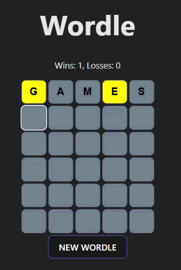

# Wordle (React)

> **Beginner project.** This is one of my first React projects, built to practice components, hooks and state management. It's a fully playable game, but I know it has room to grow; see [Known limitations](#known-limitations-and-ideas-for-improvement) for what I'd improve next.

A clone of the popular word-guessing game, built with **React** and **Vite**. You have six attempts to guess a hidden five-letter word, and each guess is color-coded to show how close you were.



## Features

- Six attempts to guess a random five-letter word
- Per-letter feedback: **green** (right letter, right spot), **yellow** (letter is in the word, wrong spot), **grey** (not in the word)
- Correct handling of **repeated letters**: feedback is computed in two passes (exact matches first, then misplaced letters limited by how many copies remain), matching the rules of the original game
- Guesses are validated against the word list, and words that don't exist are rejected
- Modal dialogs for "invalid word", "you won" and "you lost" (accessible `alertdialog`), which can also be dismissed with the **Enter** key
- Win/loss counter that carries across rounds in the same session
- "New Wordle" button to start a fresh round at any time
- Keyboard-driven input: typing advances to the next tile, Backspace moves back

## Tech stack

| Area | Tools |
| --- | --- |
| UI | React |
| Build tool | Vite  |
| Linting | ESLint  with `react-hooks` and `react-refresh` plugins |
| Styling | Plain CSS |

## Getting started

Requires Node.js 18 or newer.

```bash
git clone https://github.com/Ludovico02/wordle-react-v1.git
cd wordle-react-v1
npm install
npm run dev
```

Then open the URL printed in the terminal (usually http://localhost:5173).

Other scripts:

```bash
npm run build     # production build into dist/
npm run preview   # serve the production build locally
npm run lint      # run ESLint
```

## How it works

```
src/
├── App.jsx                 # Page title + <Wordle />
├── components/
│   ├── Wordle.jsx          # Game state: secret word, win/loss counters, guess checking, modals, reset
│   ├── Board.jsx           # Renders the six guess rows
│   └── WordGuess.jsx       # One row of five inputs; handles typing, focus and validation
├── services/
│   └── api.js              # Loads the word list and picks the random secret word
└── css/WordGuess.css       # Tile and feedback colors
public/
└── data/
    └── common_words.txt    # Word list used for secret words and valid guesses
```

**Game flow**

1. On load, `Wordle` fetches the word list and picks a random secret word.
2. `Board` renders six `WordGuess` rows; only the row matching `currentGuessIndex` is enabled.
3. When the five tiles in the active row are filled, `WordGuess` checks the word against the list. If it's valid, `Wordle.checkGuess` returns a `right` / `present` / `wrong` result for each letter, and the game advances to the next row (or ends on a win or after the sixth guess). If it isn't valid, a modal is shown.
4. State lives in `Wordle` and flows down through props; `gameId` is bumped on every reset so each row clears itself.

## Known limitations and ideas for improvement

- **Small word list:** the same ~100 common words are used for the secret word.
- **No on-screen keyboard**, so there is no running record of which letters were used.
- **State is passed through several levels of props**; a custom `useWordle` hook or `useReducer` / Context would simplify it.
- **No tests yet.** The guess-checking logic would be a good first candidate for unit tests (e.g. with Vitest).
- **Mobile polish:** the layout hasn't been tuned for small screens.
- **Persistence:** win/loss stats reset on page reload; `localStorage` would keep them.
- **Hosting:** data files are fetched from the site root (`/data/...`), so the app should be deployed at the root of a domain (Netlify, Vercel, etc.) rather than a sub-path.
